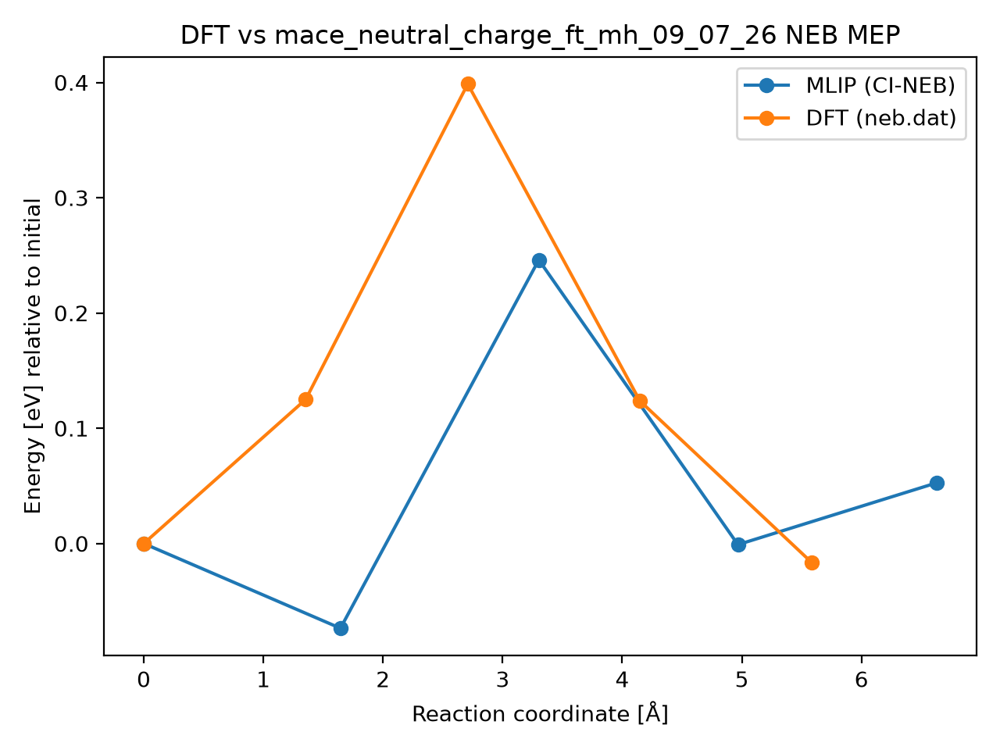

# DFT vs mace_neutral_charge_ft_mh_09_07_26 NEB MEP

## Metrics

- **mlip_barrier_eV**: 0.246049800129299
- **mlip_deltaE_eV**: 0.05269742664211208
- **dft_barrier_eV**: 0.398667
- **dft_deltaE_eV**: -0.016638
- **energy_RMSE_eV**: 0.14632433418308471
- **Mlip dt**: 0.8303571428571429
- **Mlip_d3 dt**: 1.0
- **mlip_d3 climb dt**: None
- **Total NEB time (s)**: 107.0
- **max_F_perp_eV_per_A**: 0.16104642104034156
- **force_RMSE_eV_per_A**: None
- **max_force_err_eV_per_A**: None
- **model**: mace_neutral_charge_ft_mh_09_07_26
- **raw_dir**: /home/uqctwee1/PhD_wsl/projects/mlip/mlip-workflows/neb_tests/g_CsPbI2Br/VBr0/Pb50/8d-Br8d/results/raw
- **dft_neb_dat**: /home/uqctwee1/PhD_wsl/projects/mlip/mlip-workflows/neb_tests/g_CsPbI2Br/VBr0/Pb50/8d-Br8d/neb.dat

## Plot

