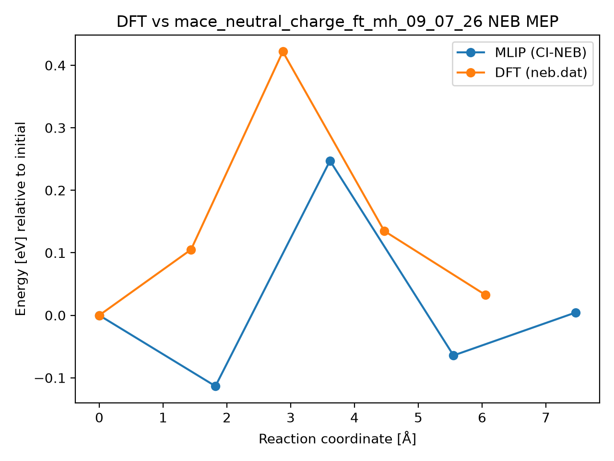

# DFT vs mace_neutral_charge_ft_mh_09_07_26 NEB MEP

## Metrics

- **mlip_barrier_eV**: 0.24724338764900722
- **mlip_deltaE_eV**: 0.004518496052355658
- **dft_barrier_eV**: 0.421815
- **dft_deltaE_eV**: 0.032373
- **energy_RMSE_eV**: 0.17269780448322225
- **Mlip dt**: 0.8333333333333334
- **Mlip_d3 dt**: 1.0
- **mlip_d3 climb dt**: 1.0
- **Total NEB time (s)**: 140.0
- **max_F_perp_eV_per_A**: 0.10033104824502177
- **force_RMSE_eV_per_A**: None
- **max_force_err_eV_per_A**: None
- **model**: mace_neutral_charge_ft_mh_09_07_26
- **raw_dir**: /home/uqctwee1/PhD_wsl/projects/mlip/mlip-workflows/neb_tests/g_CsPbI2Br/VBr0/Pb50/8d-I4c/results/raw
- **dft_neb_dat**: /home/uqctwee1/PhD_wsl/projects/mlip/mlip-workflows/neb_tests/g_CsPbI2Br/VBr0/Pb50/8d-I4c/neb.dat

## Plot

