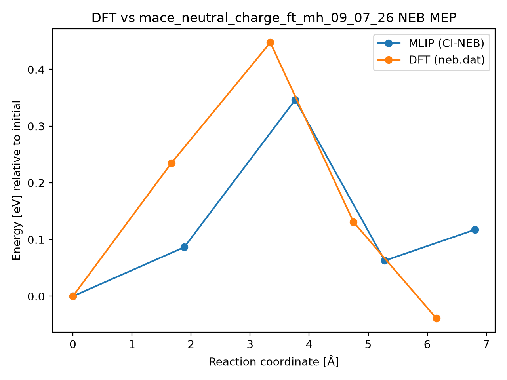

# DFT vs mace_neutral_charge_ft_mh_09_07_26 NEB MEP

## Metrics

- **mlip_barrier_eV**: 0.3464573538955733
- **mlip_deltaE_eV**: 0.1174900039336535
- **dft_barrier_eV**: 0.447353
- **dft_deltaE_eV**: -0.038867
- **energy_RMSE_eV**: 0.11754470790640352
- **Mlip dt**: 0.819047619047619
- **Mlip_d3 dt**: 0.9230769230769231
- **mlip_d3 climb dt**: 1.0
- **Total NEB time (s)**: 132.0
- **max_F_perp_eV_per_A**: 0.1365294205597563
- **force_RMSE_eV_per_A**: None
- **max_force_err_eV_per_A**: None
- **model**: mace_neutral_charge_ft_mh_09_07_26
- **raw_dir**: /home/uqctwee1/PhD_wsl/projects/mlip/mlip-workflows/neb_tests/g_CsPbI2Br/VI0/Pb57/8d-Br8d/results/raw
- **dft_neb_dat**: /home/uqctwee1/PhD_wsl/projects/mlip/mlip-workflows/neb_tests/g_CsPbI2Br/VI0/Pb57/8d-Br8d/neb.dat

## Plot

