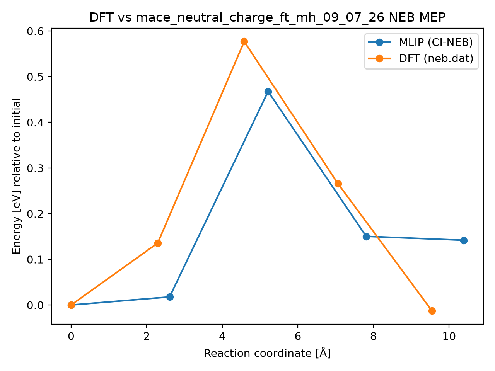

# DFT vs mace_neutral_charge_ft_mh_09_07_26 NEB MEP

## Metrics

- **mlip_barrier_eV**: 0.4675929019260252
- **mlip_deltaE_eV**: 0.14183423369826187
- **dft_barrier_eV**: 0.576865
- **dft_deltaE_eV**: -0.012699
- **energy_RMSE_eV**: 0.13222940004755726
- **Mlip dt**: 0.828125
- **Mlip_d3 dt**: 1.0
- **mlip_d3 climb dt**: None
- **Total NEB time (s)**: 185.0
- **max_F_perp_eV_per_A**: 0.1748321033531713
- **force_RMSE_eV_per_A**: None
- **max_force_err_eV_per_A**: None
- **model**: mace_neutral_charge_ft_mh_09_07_26
- **raw_dir**: /home/uqctwee1/PhD_wsl/projects/mlip/mlip-workflows/neb_tests/g_CsPbI2Br/VI0/Pb57_8d-Pb50_Br8d/results_0.01/raw
- **dft_neb_dat**: /home/uqctwee1/PhD_wsl/projects/mlip/mlip-workflows/neb_tests/g_CsPbI2Br/VI0/Pb57_8d-Pb50_Br8d/neb.dat

## Plot

